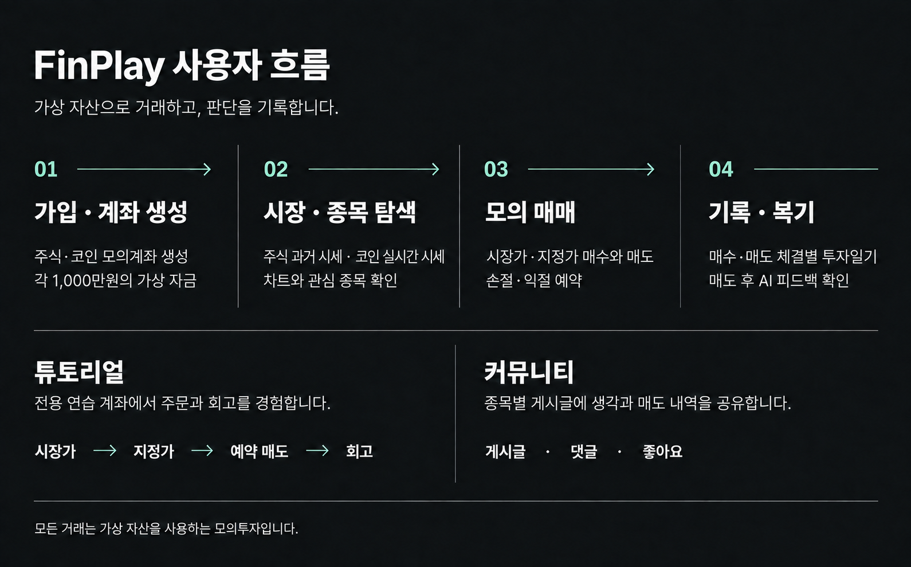
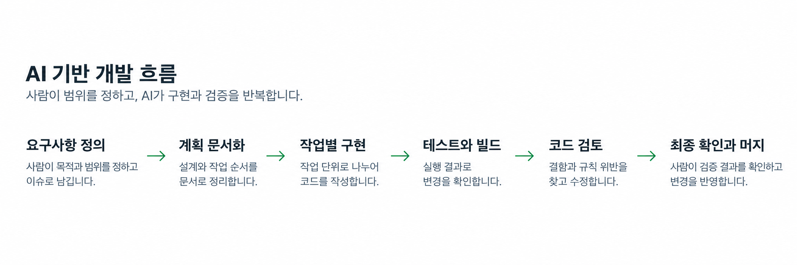

<div align="center">


# FinPlay

**Finance + Play — 가상의 시드 자산으로 배우는 진짜 투자 감각**

실전처럼 연습하고, AI로 복기하고, 기록으로 실력을 쌓아가세요.


[서비스 바로가기](https://www.finplay.site) · [API 헬스체크](https://finplay.site/actuator/health) · [프론트엔드 레포](https://github.com/finplay-team/finplay-frontend)

</div>

---

## 목차

| 순서 | 섹션 | 내용 |
|---|---|---|
| 1 | [프로젝트 소개](#프로젝트-소개) | 무엇을, 왜 만들었는가 |
| 2 | [팀 X-TEN](#팀-x-ten) | 팀원·역할·개발 분담 |
| 3 | [핵심 기능](#핵심-기능) | 튜토리얼 → 모의투자 → 투자일기 → AI 피드백 |
| 4 | [시스템 아키텍처](#시스템-아키텍처) | 인프라 구성과 도메인 구조 |
| 5 | [기술적 의사결정](#기술적-의사결정) | ADR 기반 핵심 결정과 근거 |
| 6 | [성능·정합성 검증](#성능정합성-검증) | 측정한 수치와 그 조건 |
| 7 | [AI 기반 개발 프로세스](#ai-기반-개발-프로세스) | 문서 정본과 검증 절차 |
| 8 | [기술 스택](#기술-스택) | 사용 기술 전체 |
| 9 | [개발 가이드](#개발-가이드) | 실행·테스트·문서 지도·팀 규칙 |

---

## 프로젝트 소개

**FinPlay는 모의 시드머니로 주식과 코인 거래를 연습하는 교육형 모의투자 플랫폼입니다.** 모의계좌로 거래하기 때문에 손실 부담이 없고, 판단이 틀렸을 때도 감정에 흔들리지 않고 그 원인을 복기할 수 있습니다.

체결 과정은 실제 시세를 사용합니다. 코인은 빗썸 실시간 시세 12종목으로 24시간 거래하고, 주식은 한국투자증권(KIS) Open API로 수집한 실제 과거 거래일 데이터 16종목을 모든 사용자에게 같은 순서로 재생합니다. 주식의 1분봉은 재생 세션에 확정된 과거 거래일 원본을 사용하고, 일·주·월봉의 과거 구간은 별도 3년 일봉 아카이브를 사용합니다. 가입 시 코인·주식 계좌가 각 1,000만원의 가상 현금과 함께 생성됩니다.

투자를 처음 시작하는 사람은 튜토리얼 시나리오를 따라가며 매매 기본기를 익히고, 이후 모의투자에서 체결 내역과 수익률을 확인하며 자신의 매매 습관을 점검해나갈 수 있습니다.

> 데이터 이용 조건 — 코인은 빗썸 공개 실시간 시세, 주식은 KIS Open API로 조회한 과거 데이터를 비상업적 교육 목적으로 가공·표출합니다. 실시간 주식 시세는 제공하지 않으며, 모든 매매는 모의투자입니다.

이 레포는 **백엔드 API 서버**입니다. 프론트엔드는 [finplay-frontend](https://github.com/finplay-team/finplay-frontend)(Vite + React + TypeScript)에 있습니다. <br>
### 사용자 이용 흐름



---

## 팀 X-TEN

| 이름 | GitHub | 역할 | 개발 담당 |
|---|---|---|---|
| 남동엽 | [@namdongyeob](https://github.com/namdongyeob) | 리더 — 전체 일정·마감 관리 | 인증, 보안, 뉴스 요약, AI 피드백 |
| 정욱재 | [@WookJaes](https://github.com/WookJaes) | 부리더 — 액션 플랜 정리, 이슈 탐지 | 시장가 매매, 지정가 매매, 포트폴리오, 랭킹 |
| 박채빈 | [@pcb2002](https://github.com/pcb2002) | 발표 담당 | 커뮤니티, 투자 교육, OCO 주문, 즐겨찾기 |
| 정예진 | [@yxejxnn](https://github.com/yxejxnn) | 기록 담당 — 회의록·README 수합 | 실시간 시세 연동, 투자일기, 과거 분봉 데이터 처리, 배포 |

매일 20:30 데일리 스크럼으로 진행 상황·질문·어려운 부분을 공유하고, 코드 피드백은 GitHub 리뷰에 남긴 뒤 팀 노션에 정리하는 방식으로 협업했습니다.

---

## 핵심 기능

### 1. 튜토리얼 — 실패해도 안전한 첫 매매

모의투자 자산과 분리된 전용 계좌·전용 종목으로, 시장가 즉시 체결 → 지정가 대기 체결 → 예약 매도(손절·익절)를 순서대로 경험합니다. 기준을 미리 정하면 시스템이 대신 실행해주는 경험과, 진입 근거·종료 사유가 그대로 남는 되돌아보기까지가 한 사이클입니다. 코인·주식별 첫 완주 시 500만원 보상이 모의투자 계좌로 지급됩니다.

### 2. 모의투자 — 실제 시세로 하는 실전 연습

코인 실시간 12종목, 주식 과거 재생 16종목의 차트(1분·일·주·월봉)를 보며 시장가·지정가 주문을 넣고, 예약 매도로 손절·익절선을 설정합니다. 주식 일·주·월봉은 과거 3년 아카이브와 재생용 1분봉을 거래일 경계에 맞춰 사용합니다. 커뮤니티에서 게시글·댓글로 생각을 나누고, 매도 체결 내역을 카드로 첨부해 공유할 수 있습니다.

### 3. 투자일기 — 판단의 근거를 남기는 기록

매수·매도 체결 각각에 회고를 작성하고 언제든 수정할 수 있습니다. 매수·매도 회고를 시간순으로 병합한 하나의 목록으로 조회하며, 남긴 회고는 AI 피드백의 소재가 됩니다.

### 4. AI 피드백 — 복기를 돕는 세 가지 시선

- **변동 원인 카드** — 뉴스·공시와 가격 변동을 엮어 "왜 움직였는지"를 설명합니다. 코인은 가격 스냅샷 감시로 변동을 감지한 시점 기준으로 생성됩니다.
- **장 시작 전 브리핑** — 개장 전 시장 상황을 요약합니다.
- **매도 직후 복기** — 원가·손익·보유 구간을 정리하고, "더 들고 있었다면"·"더 일찍 팔았다면" 반사실 수익률(수수료 반영)과 같은 이벤트를 겪은 다른 사용자와의 비교 지표를 제공합니다. 표본이 부족하면 비교하지 않고 그 사실을 안내하며, 일기를 수정하면 다음 조회에서 변경을 감지해 피드백을 다시 생성합니다.

---

## 시스템 아키텍처


EC2 종료로 DB 데이터를 잃은 실사고를 계기로 DB·캐시·이미지를 전부 관리형 서비스(RDS·ElastiCache·S3)로 분리했습니다 — **서버를 언제든 버려도 원장이 남습니다.** 네트워크·IAM·EC2·ALB·RDS·ElastiCache·S3·CloudFront는 Terraform으로 정의합니다. 이 구성은 웹 EC2 2대를 하나의 ALB 타깃 그룹에 두고, 스케줄러 EC2 1대는 ALB에 등록하지 않습니다. 프론트 정적 파일은 S3·CloudFront에서 백엔드와 독립적으로 제공하도록 구성합니다.

배포 워크플로우는 `dev` 머지를 트리거로 GitHub Actions의 OIDC 임시 자격증명, ECR 이미지, SSM을 사용해 웹 인스턴스를 한 대씩 등록 해제 → 교체 → 헬스체크 → 재등록하는 롤링 배포를 수행하도록 구성합니다. Web(`prod,web`)과 Scheduler(`prod,scheduler`) 런타임을 분리했고, 스케줄러가 발행한 주식 가격·상태 이벤트는 Redis Pub/Sub를 통해 각 Web 인스턴스의 SSE로 전달됩니다. 빗썸 피드는 Redis 리더 선출로 중복 연결을 억제하고, 스케줄러 재시작·시세 이벤트 누락은 영속 `PENDING` 주문과 OCO를 재검사하는 복구 경로로 보완합니다 (ADR-0020, ADR-0021, ADR-0030, ADR-0031). 자동 롤백은 앱만 되돌리므로 파괴적 스키마 변경은 두 배포로 분할합니다.

### 백엔드 구조

레이어드 아키텍처(`controller → service → repository`)에 도메인 기준 패키지 구조를 씁니다 (ADR-0002, ADR-0029). 도메인 간 참조는 service 레이어로만 하고, 전역 공통은 `global`(설정·예외·필터·분산 락)에 둡니다.

| 도메인 | 역할 |
|---|---|
| auth | 이메일 회원가입·로그인·JWT 재발급, 카카오·네이버 OAuth, 비밀번호 재설정 |
| account | 가입 시 STOCK·CRYPTO 초기 계좌 생성, 계좌 요약, 튜토리얼 계좌 |
| market | 종목·캔들(1m/1d/1w/1M) 조회, KIS 시세·일봉 아카이브 수집, 주식 SSE 스트림, 재생 세션 |
| order | 시장가 체결, 코인 지정가(에스크로) 비동기 체결·복구 재검사, OCO 손절·익절 예약, Idempotency-Key 멱등성 |
| portfolio | 보유 종목, FIFO lot 기반 원가·평가금액·미실현손익 계산 |
| journal | 매수·매도 체결에 대한 투자일기·회고 작성과 통합 조회 |
| feedback | AI 피드백 — 뉴스·공시 수집과 요약, 개장 전 브리핑, 변동 원인 카드, 매도 직후 복기 |
| education | 시장별 3단계 투자 실습·튜토리얼 (시나리오 재생, 관찰·복기, 합성 시세) |
| ranking | 시장별 실현손익 랭킹 (Redis ZSET, 원장 기반 재구성) |
| community | 게시글·댓글·좋아요, 이미지 첨부 (로컬/S3 저장 추상화) |
| watchlist / favorite | 관심목록·종목 즐겨찾기 (favorite는 튜토리얼 전용, 인메모리) |

API는 base URL `/api`를 사용하며 버저닝하지 않습니다. 공개 인증·헬스체크·Swagger를 제외한 모든 요청은 `Authorization: Bearer` 토큰을 요구합니다. 전체 라우트 지도는 [`ai/api-routes.md`](ai/api-routes.md), 도메인별 계약은 [`docs/api/`](docs/api/), JPA 엔티티 43개의 ERD는 [`docs/erd.md`](docs/erd.md)에 있습니다.

---

## 기술적 의사결정

주요 기술적 결정은 저장소의 ADR을 정본으로 삼습니다. 아래는 현재 구현에 직접 반영된 결정과 그 근거를 요약한 것입니다.

- **지정가 체결은 새 메시지 브로커 대신 파티션별 단일 워커와 제한된 큐를 사용합니다.** 같은 종목의 체결 순서를 보존하면서 피드 스레드를 막지 않고, 후보는 기본 50건 청크 단위로 커밋합니다. 배치 10건보다 50건이 빠른 실측(6,309ms 대 4,418ms)을 근거로 50건을 선택했습니다 ([ADR-0024](ai/adr/0024-limit-order-fill-executor.md), [ADR-0025](ai/adr/0025-limit-order-fill-batch-commit.md)).
- **조회 캐시는 Spring Cache 추상화 대신 cache-aside를 직접 구현합니다.** 응답 전체가 아니라 시각 비의존 조각만 캐시하고, TTL은 고정값이 아닌 다음 개장·다음 정시·다음 수집 시각 같은 도메인 경계로 계산합니다. 만료 시 원본 조회 쏠림은 Redis 분산 락으로 완화하고, 락 대기가 끝나면 조회 경로는 DB로 열어둡니다 ([ADR-0015](ai/adr/0015-feedback-query-cache.md)).
- **Redis 락의 장애 정책은 경로별로 다릅니다.** 코인 변동 감시처럼 중복 LLM 호출 비용을 막는 부가 기능은 락을 얻지 못하면 해당 틱을 건너뛰고([ADR-0014](ai/adr/0014-crypto-watch-redis-lock.md)), 조회 캐시는 락 장애 시 DB로 진행합니다([ADR-0015](ai/adr/0015-feedback-query-cache.md)).
- **상태 저장소는 EC2 밖의 관리형 서비스로 분리하고, Terraform 기반 롤링 배포 구성을 둡니다.** 원장·캐시·업로드 파일은 각각 RDS·ElastiCache·S3에 두고, 웹 2대와 스케줄러 1대로 분리하는 구성을 정의합니다 ([ADR-0020](ai/adr/0020-managed-service-deployment.md), [ADR-0030](ai/adr/0030-rolling-deploy-multi-instance.md), [ADR-0031](ai/adr/0031-remove-cloudwatch-agent.md)).

전체 결정 기록은 [`ai/adr/`](ai/adr/)(0001~0032, 32건)에, 기각 목록과 근거는 각 ADR에 있습니다.

---

## 성능·정합성 검증

아래 수치는 저장소에 기록된 성능 실측과 정합성 검증 결과를 조건·한계와 함께 정리한 것입니다.


| 영역 | 결과 | 조건·대가 |
|---|---|---|
| 지정가 체결 청크 벌크 락 | 500건 처리 2,099ms → **1,434ms** (31.7%↓) | 계좌 15개 풀·50건 청크·Testcontainers 3회 중앙값. [`벌크 락 실측`](docs/loadtest/limit-order-fill-batch-bulk-lock-benchmark-result.md) |
| holdings INSERT 데드락 완화 | baseline 40건 중 32건 → **0건** | `READ COMMITTED` 적용 후 baseline median 13ms → 27ms, contended 45ms → 68ms. [`데드락 실측`](docs/loadtest/holdings-insert-deadlock-result.md) |
| 지정가 벌크 락과 시장가 경합 | 시장가 주문 완료 median 14ms → 18ms | 계좌 15개 풀·5회 중앙값. 한 회차에서 243ms 최악 대기도 관측해 중앙값만으로 일반화하지 않음. [`경합 실측`](docs/loadtest/limit-order-fill-market-order-contention-benchmark-result.md) |
| 주식 분봉 수집 | 16종목 중 1종목 → **16종목 전부** (5,630건) | 수집 결과는 [`시장 API 문서`](docs/api/market.md)에 기록되어 있으며, 성능 중앙값이 아닌 수집 검증 결과입니다. |

지정가 체결·동시성 관련 벤치마크의 원자료는 [`docs/loadtest/`](docs/loadtest/)에 있습니다. 해당 벤치마크 수치는 수동 실측 중앙값이며 CI 성능 임계값이 아니므로, 조건과 한계를 함께 확인해야 합니다.

---

## AI 기반 개발 프로세스



AI 도구를 활용하되, 요구사항은 [`ai/prd.md`](ai/prd.md), 작업별 문서 범위는 [`ai/context-router.md`](ai/context-router.md), 설계 결정은 ADR을 정본으로 삼습니다. 기능 변경은 spec → 계획 → 구현 → 테스트 → 리뷰 순서로 진행하고, 필요에 따라 계획·구현·테스트·리뷰 역할을 분리합니다 (ADR-0005, ADR-0008, ADR-0009).

controller를 변경하면 라우트 목록과 도메인별 API 계약을 같은 변경에서 동기화합니다. 문서·설정처럼 파일 1~2개 규모의 작업은 경량 경로로 처리하고, 코드 변경은 GitHub Actions의 Standard 경로에서 단일 Quality Gate로 검증합니다. 최종 PR 승인과 merge는 사람이 수행하며 조건부 자동 승인·봇 승인은 사용하지 않습니다 (ADR-0032).

---

## 기술 스택

| 구분 | 사용 기술 |
|---|---|
| 언어·프레임워크 | Java 17, Spring Boot 4.1 (Gradle 9.5, Groovy DSL) |
| 데이터 | MySQL 8.4, Spring Data JPA + QueryDSL, Flyway, Redis 7.4(로컬)·ElastiCache Redis 7.1(운영) — 캐시·랭킹 ZSET·분산 락 |
| 인증 | Spring Security + JWT (Access/Refresh 회전), 카카오·네이버 OAuth 2.0 |
| AI | Spring AI 2.0 (OpenAI) — 뉴스 요약·브리핑·매도 복기 서술 생성 |
| 실시간 | Spring WebSocket (빗썸 수신), Redis Pub/Sub, SSE (주식 시세 push), `@Scheduled` 크론 배치 |
| 테스트·품질 | JUnit 5, Mockito, Testcontainers, K6, Spotless (NAVER 스타일), SpotBugs, JaCoCo 40% 게이트 |
| 인프라 | AWS (EC2, ALB, RDS, ElastiCache, S3, CloudFront, ECR, SSM, OIDC), Terraform, Docker, GitHub Actions 롤링 CD |
| 외부 연동 | KIS Open API(주식), 빗썸 API(코인), 네이버 뉴스 검색, OpenDART 공시, Resend(이메일) |

외부 API 키가 없어도 기동·빌드는 성공합니다 — 비-prod 프로필에서는 Fake 구현(이메일·뉴스·공시·코인 시세)이 대신 뜨고, 실데이터는 `crypto-real`·`news-real` 프로필로 켭니다.

---

## 개발 가이드

> ⚠️ **반드시 영문 경로에 클론하세요.** 한글이 포함된 경로에서는 Gradle 테스트 워커가 클래스패스를 읽지 못해 테스트가 전부 `ClassNotFoundException`으로 실패합니다.

### 실행

요구사항: JDK 17, Docker Desktop.

```bash
./gradlew bootRun    # compose.yaml의 MySQL 8.4(:13307)·Redis 7.4(:16379)를 자동으로 띄우고 연결함
```

- Swagger UI: http://localhost:8080/swagger-ui.html
- 헬스체크: http://localhost:8080/actuator/health

환경변수가 필요한 기능(OAuth 로그인, 실시간 시세, AI 등)은 `.env`를 셸에 주입한 뒤 실행합니다. 목록은 `.env.example`이 정본이고, 실제 값은 gitignore된 `.env`에만 둡니다.

```bash
set -a; . ./.env; set +a
SPRING_PROFILES_ACTIVE=local ./gradlew bootRun
```

### 테스트

```bash
./gradlew build           # 전체 (Testcontainers 통합 테스트 포함, Docker 필요)
./gradlew test            # 테스트만
./gradlew spotlessApply   # 커밋 전 코드 포맷 (필수)
```

테스트 전략은 3단계 피라미드입니다 (ADR-0003). 서비스 로직은 단위 테스트, Repository 쿼리는 `@DataJpaTest`, API 계약은 `@WebMvcTest`, 핵심 시나리오는 Testcontainers 통합 테스트로 검증하며, H2 대신 Testcontainers MySQL(`mysql:8.4` 고정)을 씁니다. Docker가 없으면 `--tests` 필터로 단위 테스트만 선별 실행할 수 있습니다.

### 문서 지도

`docs/`는 사람이 보는 제품 문서, `ai/`는 AI 개발 워크플로 산출물입니다.

| 문서 | 내용 |
|---|---|
| [`CLAUDE.md`](CLAUDE.md) / [`AGENTS.md`](AGENTS.md) | Claude Code / Codex 프로젝트 규칙 |
| [`docs/prd.md`](docs/prd.md) | 사람용 제품 요구사항 문서 |
| [`ai/prd.md`](ai/prd.md) | AI용 요구사항 정본 — 요구사항 ID·수용 기준·구현 현황 |
| [`docs/conventions/`](docs/conventions/) | 코드([code.md](docs/conventions/code.md))·Git([git.md](docs/conventions/git.md))·팀 운영([team.md](docs/conventions/team.md)) 컨벤션 |
| [`ai/adr/`](ai/adr/) | 아키텍처 결정 기록 (0001~0032, 32건) |
| [`ai/specs/`](ai/specs/) | 기능 명세 (번호 spec 59건, spec → plan → tasks) |
| [`ai/api-routes.md`](ai/api-routes.md) | API 엔드포인트 지도 (라우트 목록·인증 규칙) |
| [`docs/api/`](docs/api/) | 도메인별 요청·응답·오류 계약 |
| [`docs/erd.md`](docs/erd.md) | JPA 엔티티·DB 테이블 구조 지도 |
| [`docs/loadtest/`](docs/loadtest/) | 부하 테스트·벤치마크 결과 |

### 팀 규칙 요약

정본은 [`docs/conventions/git.md`](docs/conventions/git.md)와 [`docs/conventions/team.md`](docs/conventions/team.md)입니다.

- `dev`가 통합 브랜치. `<타입>/<이슈번호>-<영문-요약>`으로 분기 → dev로 PR → 리뷰 승인 1명 후 Merge commit. **`dev` 머지는 웹 2대·스케줄러 1대 롤링 배포 워크플로우를 트리거하도록 구성돼 있습니다** (ADR-0021, ADR-0030).
- 최종 PR 승인과 merge는 사람이 수행하며 조건부 자동 승인·자동 merge는 사용하지 않습니다 (ADR-0032).
- `main`은 시연·심사 스냅샷 — 직접 푸시 금지, `dev`에서 PR로만 머지.
- 커밋/PR 제목은 Conventional Commits (`feat:`, `fix:`, ...). 하나의 커밋 = 하나의 논리적 변경.
- 시크릿은 어떤 값도 yml·코드에 커밋 금지, 스키마 변경은 Flyway 마이그레이션으로만 (ADR-0004).
- 기능 개발은 `/feature`, PR 리뷰는 `/review-pr` 스킬로 — 파일 1~2개 규모 작업만 메인 세션이 직접 구현합니다 (ADR-0005).
